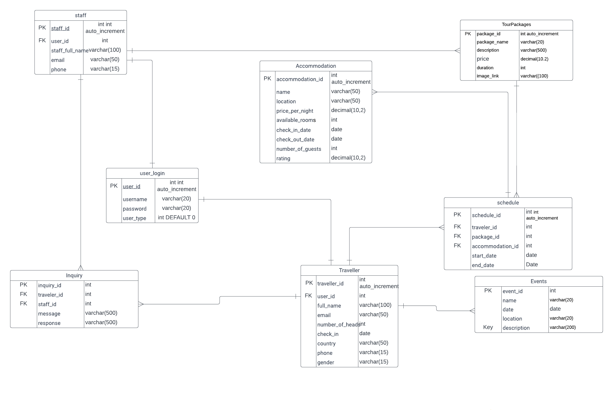

# Exercise 5: Readme.md

***Welcome to the task README!***

- You are required to create ´Readme.md´ in your project directory to document your activities throughout the project's lifecycle. 
- You will regularly update it to monitor the ongoing development of the project. 

- You will start by outlining the planned features, task assignments to team members and document the evolving progress of your work. 

- Below, you will find an example to help you get started. Feel free to customize it to match your specific requirements and needs.

# Travel Sri Lanka - Team 12

-Travel SriLanka "Travel Sri Lanka" project! This project aims to provide information about Srilankan nature ,diverse culture,stunning,landscapes and warm hospitality with national events .

## Table of Contents
- [Features](#features)
- [Database Tables](#database-tables)
- [Created Forms](#created-forms)
- [Created Tables](#created-tables)

---

## Features

In this section, list and describe the features or functionality that you are working on. You can use checkboxes to track the progress of each feature.

- [X] Create staff login to create and update current tour packages.(Kaluarachchige Kaluarachchi)-Customize tour packages.
- [X] Create cost information according to traveller’s plan schedule  (Nuwani Fernando)- Travellers plan & cost details
- [ ] create to find accomadation details(Supun Weerasinghe)-Hotels and Resorts 
- [ ] create to find events details align to travelers visit.(Kulakshi Herath)-Upcoming Events
- [X] create Traveler inquery form that can read and reply staff.(Kaluarachchige Kaluarachchi)-Traveler inquery

> Add features as required. 

### Feature 1

Create staff login  for  create,update and delete  tour packages.Also create admin menu in footer section
Customer view created for packges with data filter facility.staff user id : admin password: password
-[staff login (shell)](http://shell.hamk.fi/~kaluarachchige23000/webpro/Travel/login.php)
-[staff login (github)](https://github.com/dinusha4010/Travel/blob/main/login.php)
-[staff function (shell)](http://shell.hamk.fi/~kaluarachchige23000/webpro/Travel/staff.php)
-[staff function (github)](https://github.com/dinusha4010/Travel/blob/main/staff.php)
-[Tour package create (github)](https://github.com/dinusha4010/Travel/blob/main/create_package.php)
-[Tour package create (shell)](http://shell.hamk.fi/~kaluarachchige23000/webpro/Travel/create_package.php)
-[Tour package edit (github)](https://github.com/dinusha4010/Travel/blob/main/tour_update.php)
-[Tour package edit (shell)](http://shell.hamk.fi/~kaluarachchige23000/webpro/Travel/staff_view.php)
-[Tour package remove (github)](https://github.com/dinusha4010/Travel/blob/main/tour_remove.php)
-[Tour package remove (shell)](http://shell.hamk.fi/~kaluarachchige23000/webpro/Travel/staff_view.php)
-[customer view(shell)](https://github.com/dinusha4010/Travel/blob/main/package.php)
-[customer view(github)](http://shell.hamk.fi/~kaluarachchige23000/webpro/Travel/package.php)
### Feature 2
Creating a simple design to obtain cost details considering traveller’s requirements such as head count , number of stays inclusively.
This will further assists traveller to get an idea of what kind of areas to be selected according to his desires.
.
https://github.com/dinusha4010/Travel
http://shell.hamk.fi/~nuwani23000/Travel/feature2.php 
http://shell.hamk.fi/~nuwani23000/Travel/process5.php 

### Feature 3

Include more detailed information about Feature 3 here. Provide links to related code files (github) & link to the feature (shell.hamk.fi) .

### Feature 4

Include more detailed information about Feature 3 here. Provide links to related code files (github) & link to the feature (shell.hamk.fi) .

### Feature 5

create a cutomer inquiry page and staff page to taken action for customer inquiry and customer inquiry histroy page with data filtering.

-[cutomer inquiry (shell)](http://shell.hamk.fi/~kaluarachchige23000/webpro/Travel/Inquiry.php)
-[cutomer inquiry (github)](https://github.com/dinusha4010/Travel/blob/main/Inquiry.php)
-[staff response  (shell)](http://shell.hamk.fi/~kaluarachchige23000/webpro/Travel/staff_response.php)
-[staff response  (github)](https://github.com/dinusha4010/Travel/blob/main/inquiry_update.php)
-[inquiry hitory  (shell)](http://shell.hamk.fi/~kaluarachchige23000/webpro/Travel/inquiry_history.php)
-[inquiry hitory  (github)](https://github.com/dinusha4010/Travel/blob/main/inquiry_history.php)

---

## Database Tables

List the database tables that are part of your project. 

- user_login (Created By : Kaluarachchi KCD)
- tour_packages (Created By : Kaluarachchi KCD)
- schedule (Created By : Kaluarachchi KCD)
- Traveller (Created By : Nuwani Fernando)
- staff (Created By : Nuwani Fernando)
- accommodation (Created By : Supun Weerasinghe)
- inquiry (Created By : Kulakshi Herath)
- events (Created By : Kulakshi Herath)

> Include the ER Diagram of the database. 

---

## Created Forms

List and describe any forms that have been created as part of your project. Include details about the purpose of each form and any validation logic.

- Form 1 :(Kaluarachchi KCD): Package create: [link (github)](https://github.com/dinusha4010/Travel/blob/main/create_package.php) | [link (shell)](http://shell.hamk.fi/~kaluarachchige23000/webpro/Travel/create_package.php) | Validations Applied
- Form 2: (Kaluarachchi KCD): Customer inquiry :[link (github)](https://github.com/dinusha4010/Travel/blob/main/Inquiry.php) | Link to the form [link (shell)](http://shell.hamk.fi/~kaluarachchige23000/webpro/Travel/Inquiry.php).  | Validations Applied
- Form 3: (Created By): Form Name: Link to the related code file (github) | Link to the form (shell.hamk.fi).  | Validations Applied

---

## Created Tables

List any tables that you have created in the project work

- Table 1 (Kaluarachchi KCD): Traveler package update and remove | [link (github)](https://github.com/dinusha4010/Travel/blob/main/staff_view.php) | [link (shell)](http://shell.hamk.fi/~kaluarachchige23000/webpro/Travel/staff_view.php).
- Table 2 (Created By): Table Name | Link to the related code file (github) | Link to the table (shell.hamk.fi).
- Table 3 (Created By): Table Name | Link to the related code file (github) | Link to the table (shell.hamk.fi).

---

> Feel free to customize this README template to suit your project's specific needs. Providing clear and organized documentation will help your team members understand the project's progress and tasks effectively. This document will have a significant impact on the grading. 
